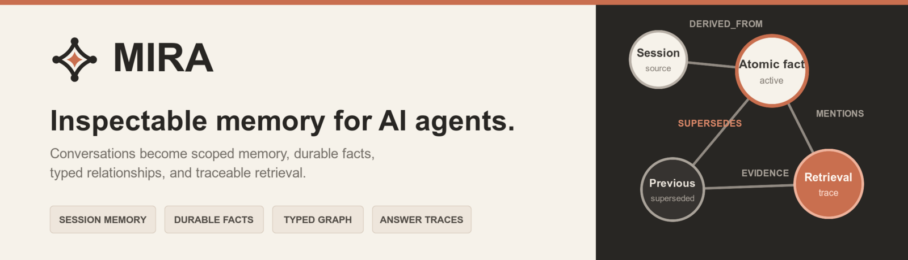
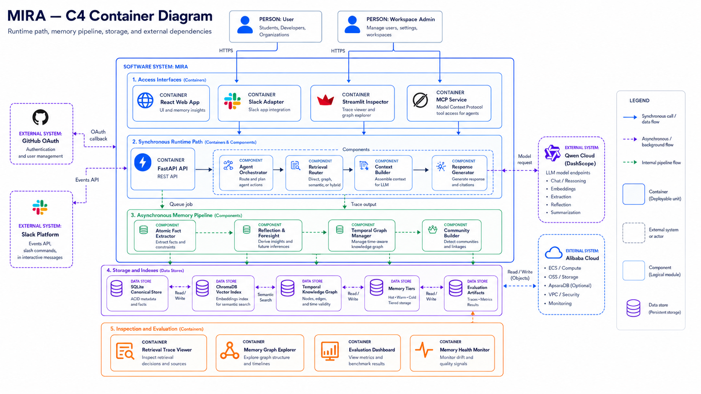

# MIRA - Memory-Integrated Reasoning Architecture

<p align="center">
  
</p>

MIRA is a reusable memory layer for AI agents. It turns conversations into structured,
inspectable, cross-session memory, then retrieves only the evidence needed for the next
answer.

[Live demo](https://mira.ninja) · [Architecture](docs/architecture.md) ·
[Technical report](docs/mira-paper.md) · [Documentation](docs/) · [MIT License](LICENSE)

> **OpenAI Build Week eligibility boundary:** MIRA existed before Build Week began on
> July 13, 2026. The core memory engine is the baseline. This README separately identifies
> the work added from July 13 through July 21 so judges can evaluate only the eligible work.
> A pull request merged on July 13 contained commits authored before the window, so it is
> treated as baseline rather than claimed as Build Week work.

## OpenAI Build Week

- **Category:** Developer Tools
- **Build tools:** Codex with GPT-5.6
- **Live demo:** [mira.ninja](https://mira.ninja)
- **Demo video:** OpenAI-specific walkthrough link pending

MIRA fits Developer Tools because it gives agent developers a memory runtime and the tools
needed to inspect it. The product exposes session state, durable facts, graph relationships,
retrieval routes, evidence traces, worker progress, memory health, provider configuration,
and evaluation results instead of hiding memory behind a single `remember()` call.

The Build Week work did not replace the existing architecture. It turned that architecture
into a safer, more inspectable product: authenticated workspaces, a live frontend, stronger
data lifecycle rules, an OAuth-protected MCP service, production deployment, administrative
controls, and fixes to classification and memory synthesis.

## The Problem

Long-running agents fail in predictable ways:

- The next session starts without the facts, decisions, and preferences established earlier.
- A correction is stored beside the old value, but retrieval still returns both as if they
  were equally current.
- Vector similarity finds related text but does not resolve temporal validity, provenance,
  or acknowledged change.
- Raw transcript stuffing consumes the context window without deciding what is relevant.
- Developers cannot tell which memory influenced an answer or why a retrieval route was
  selected.

MIRA treats the prompt as an execution buffer, not the memory store. It persists evidence,
structures it in the background, and reconstructs a bounded prompt for each turn.

## Who MIRA Is For

MIRA is for developers building:

- long-running AI agents and personal assistants;
- developer copilots and research assistants;
- customer-support and internal knowledge agents;
- workflow agents that need durable decisions and constraints;
- Slack agents; and
- MCP clients that need authenticated access to user-owned memory.

## What MIRA Does

One user turn moves through two connected timelines:

```text
User message
  -> fast persistence
  -> Session Working Set update
  -> retrieval routing and sufficiency check
  -> token-budgeted prompt
  -> model answer
  -> answer + retrieval trace persistence

Queued observation
  -> background worker
  -> atomic facts and entities
  -> typed temporal graph
  -> contradiction or supersession edges
  -> reflection, foresight, and community summaries
  -> durable retrieval indexes
```

The immediate path protects current-session corrections and constraints. The background path
builds durable memory without blocking the chat turn. Retrieval later combines those layers
through Quick, Deep, Relational, or Auto routing.

## Project Status Before Build Week

The last commit before July 13 was
[`dc33e2c`](https://github.com/jerrygeorge360/mira/commit/dc33e2ccaeac6d865b747d089c550d7e2a25c3be).
At that point, MIRA already had:

- fast observation persistence and the session micro-path;
- the Session Working Set and cross-session slow path;
- SQLite-backed observations, atomic facts, memory tiers, reflections, foresight, and
  community summaries;
- ChromaDB semantic indexing and a typed SQLite-backed graph;
- Quick, Deep, Relational, and Auto retrieval modes;
- correction, `SUPERSEDED_BY`, and `CONTRADICTS` semantics;
- token-budgeted prompt construction and retrieval traces;
- configurable OpenAI-compatible runtime providers;
- FastAPI, Streamlit, Slack, worker, local evaluation, ablation, and benchmark code; and
- ADRs 0001 through 0012 documenting the core architecture.

The saved 13/13 local evaluation and the targeted seven-case ablation also predate Build Week.
They are reported below as evidence for the baseline, not as newly created Build Week results.

## What Changed During OpenAI Build Week

### 1. Product frontend, authentication, and workspace ownership

**Problem:** The memory engine existed, but the product boundary was incomplete. A developer
could inspect local state, but browser users did not yet have a complete authenticated product
surface, and memory ownership needed to be enforced across the full runtime.

**Build Week work:** A React/TypeScript product frontend, GitHub authentication, disposable
demo workspaces, workspace-scoped repositories, schema constraints, and ownership tests were
added. Retrieval, graph reads, the worker, Chroma metadata, Slack bindings, and evaluation
fixtures were updated to carry workspace identity.

**Why it matters:** A memory system cannot be offered to multiple users if their facts can mix.
Workspace identity is now a storage and retrieval boundary rather than a frontend filter.

**Codex contribution:** Codex inspected the API, repository, worker, retrieval, UI, and test
boundaries, then helped sequence and implement the auth and ownership work without replacing the
existing memory core.

**GPT-5.6 contribution:** Through Codex, GPT-5.6 was used to reason across the multi-module data
flow, identify ownership propagation points, and review fail-closed tests.

**Evidence:** [`f31e026`](https://github.com/jerrygeorge360/mira/commit/f31e0265c7b5d5ff59865f118bb4a55b676a538e),
[`api/auth.py`](api/auth.py), [`tests/test_api_auth.py`](tests/test_api_auth.py), and
[`tests/test_workspace_ownership.py`](tests/test_workspace_ownership.py).

### 2. Live memory inspection instead of static architecture claims

**Problem:** The architecture could produce traces and structured records, but reviewers needed
to see the memory lifecycle, graph, retrieval decisions, working set, reflections, communities,
foresight, memory pressure, and evaluations in one product.

**Build Week work:** Read models and API responses were expanded, and the frontend gained live
pipeline, graph, working-set, memory-health, retrieval, community, reflection, foresight, and
results views. The chat and graph interfaces were also made usable across desktop and mobile
layouts.

**Why it matters:** Developers can inspect what was persisted, what the worker produced, what was
retrieved, and what evidence reached an answer. The architecture is observable in the product.

**Codex contribution:** Codex traced each UI field back to an implemented read model and helped
avoid presenting unsupported metrics as live data.

**GPT-5.6 contribution:** GPT-5.6 helped compare the intended memory ontology with the actual
SQLite records and API contracts, then identify the smallest read-model extensions needed.

**Evidence:** [`ee42942`](https://github.com/jerrygeorge360/mira/commit/ee4294297600c726d3662d3289156738192cc174),
[`core/memory/read_models.py`](core/memory/read_models.py),
[`frontend/src/components/PipelineView.tsx`](frontend/src/components/PipelineView.tsx), and
[`frontend/src/components/RetrievalView.tsx`](frontend/src/components/RetrievalView.tsx).

### 3. Provenance-aware deletion and runtime hardening

**Problem:** Deleting a conversation could hide the transcript while leaving unsupported facts,
entities, reflections, graph edges, communities, or vectors available for later recall.

**Build Week work:** Conversation deletion now removes that session from memory provenance,
retains records that still have another valid source, deactivates unsupported derived memory,
prunes graph lineage, removes vector entries, and resets workspace memory when the final session
is deleted. API rate limiting and clearer chat failure handling were added in the same hardening
pass. A later fix tightened workspace-scoped graph inspection and SQLite concurrency settings.

**Why it matters:** Deletion now has memory semantics. A deleted conversation cannot remain an
invisible source of truth, while shared memories supported elsewhere are preserved.

**Codex contribution:** Codex followed deletion through observations, facts, graph records,
reflections, communities, hot memory, Chroma pointers, and frontend state before implementing and
testing the lifecycle.

**GPT-5.6 contribution:** GPT-5.6 helped reason about provenance as a support graph rather than a
cascade delete, including the distinction between unsupported and multiply supported records.

**Evidence:** [`012d0a7`](https://github.com/jerrygeorge360/mira/commit/012d0a7283c7a9db2771613f3f8a654a59763ac8),
[`67d1c16`](https://github.com/jerrygeorge360/mira/commit/67d1c16c95a20ad1b37c7cc3379f8cfce478922c),
[`core/session_deletion.py`](core/session_deletion.py),
[`tests/test_api_sessions.py`](tests/test_api_sessions.py), and
[ADR-0014](docs/adr/0014-provenance-aware-conversation-deletion.md).

### 4. OAuth-authenticated MCP service

**Problem:** MIRA had Slack-oriented MCP code, but not a standalone consumer service with a
clear workspace security boundary and standards-based authorization flow.

**Build Week work:** MIRA gained a standalone Streamable HTTP MCP service, protected-resource and
authorization-server discovery, OAuth authorization code flow with PKCE, dynamic public-client
registration, consent, rotating refresh tokens, revocation, static-token compatibility, and
workspace-bound tool execution. Tool descriptions were then refined to guide models on when to
remember, search, inspect, or avoid storing content.

**Why it matters:** External agents can use MIRA as memory infrastructure without receiving a
database path or a shared master credential.

**Codex contribution:** Codex helped separate the transport service from the existing Slack
adapter, map tokens to workspaces, test cross-workspace rejection, and debug browser-client CORS
and discovery behaviour with MCP Inspector.

**GPT-5.6 contribution:** GPT-5.6 supported the OAuth and MCP threat-model review, including PKCE,
redirect validation, token hashing, resource binding, and tool-level memory safety guidance.

**Evidence:** [`9162568`](https://github.com/jerrygeorge360/mira/commit/9162568c612cdc63eee9c193e246295b6ab97bf9),
[`42a772a`](https://github.com/jerrygeorge360/mira/commit/42a772a),
[`81ef48e`](https://github.com/jerrygeorge360/mira/commit/81ef48e3bcc530f62a4e7fd4f1075f394deb33d2),
[`integrations/mcp/service.py`](integrations/mcp/service.py),
[`tests/test_mcp_oauth.py`](tests/test_mcp_oauth.py), and [ADR-0016](docs/adr/0016-authenticated-standalone-mcp-service.md).

### 5. Production deployment and operational visibility

**Problem:** Local services worked, but a public developer tool needs repeatable containers,
health checks, TLS routing, deployment gating, persistent volumes, and readable logs.

**Build Week work:** The API, worker, frontend, MCP service, Nginx gateway, TLS certificate flow,
and Dozzle log viewer were composed for production. GitHub Actions now builds and publishes
images only after CI succeeds, refreshes the server checkout, deploys a commit-addressed image,
and recreates Nginx when its bind-mounted configuration changes. Successful health probes are
filtered from application access logs.

**Why it matters:** The live demo runs the same separated API, worker, frontend, and MCP roles
described by the architecture, with persistent SQLite, Chroma, and model-cache volumes.

**Codex contribution:** Codex reviewed the service topology, health dependencies, deployment
failure modes, and log noise, then helped document and verify the final path.

**GPT-5.6 contribution:** GPT-5.6 was used to reason about container lifecycle, stale server
checkouts, bind-mounted Nginx configuration, and the difference between health monitoring and
useful operational logs.

**Evidence:** [`7ce97ad`](https://github.com/jerrygeorge360/mira/commit/7ce97ad),
[`32984da`](https://github.com/jerrygeorge360/mira/commit/32984da),
[`1fd33e2`](https://github.com/jerrygeorge360/mira/commit/1fd33e2),
[`docker-compose.prod.yml`](docker-compose.prod.yml),
[`.github/workflows/deploy.yml`](.github/workflows/deploy.yml), and
[`docs/alibaba-cloud-deployment.md`](docs/alibaba-cloud-deployment.md).

### 6. Turn classification, contradiction discipline, and reflection quality

**Problem:** Declarative updates could be treated like questions, unrelated facts sharing a
subject could be marked as contradictions, and reflections could be produced too eagerly or
bubble into unrelated answers.

**Build Week work:** MIRA gained an LLM-assisted turn-purpose classifier with deterministic
shortcuts and fallback, stricter same-property contradiction pairing, local plausibility checks,
query-aware conflict surfacing, and stronger reflection gates and synthesis rules.

**Why it matters:** The model receives less irrelevant memory, complementary facts are less likely
to contaminate each other with false conflict metadata, and declarative updates receive an
appropriate acknowledgement rather than a context dump.

**Codex contribution:** Codex traced the failure from chat input through routing, context merge,
graph edge creation, conflict injection, and reflection synthesis; it then implemented focused
guards and regression tests.

**GPT-5.6 contribution:** GPT-5.6 helped distinguish correction, supersession, unresolved
contradiction, complementary facts, and general statements across the affected layers.

**Evidence:** [`cb8c6f1`](https://github.com/jerrygeorge360/mira/commit/cb8c6f1a0eec7fb237ecb9374455410723792623),
[`core/agent.py`](core/agent.py), [`core/memory/change.py`](core/memory/change.py),
[`core/memory/reflection.py`](core/memory/reflection.py),
[`tests/test_memory_change.py`](tests/test_memory_change.py), and
[`tests/test_reflection_synthesis.py`](tests/test_reflection_synthesis.py).

### 7. Read-only administration and deployable evaluation evidence

**Problem:** Operators could not see platform counts or switch configured providers without
editing environment files, and the production Results page depended on generated files that were
correctly excluded from Docker and Git.

**Build Week work:** A login-allowlisted, read-only platform dashboard was added. It reports
aggregate platform state and lets an administrator select among configured provider profiles
without exposing provider keys. The evaluation API now prefers a fresh generated local result and
falls back to a tracked 13/13 snapshot when generated artifacts are absent.

**Why it matters:** Operators get useful visibility and provider control while the deployed demo
retains stable, auditable evaluation evidence across rebuilds.

**Codex contribution:** Codex reviewed the operator boundary, kept the dashboard read-only apart
from the narrow provider selector, and diagnosed why gitignored evaluation files disappeared in
production images.

**GPT-5.6 contribution:** GPT-5.6 helped separate runtime secrets from provider selection and
design the generated-result-first, published-snapshot-second fallback.

**Evidence:** [`8c21c6b`](https://github.com/jerrygeorge360/mira/commit/8c21c6b),
[`ec3c8ee`](https://github.com/jerrygeorge360/mira/commit/ec3c8eea19400e85aa495e5aaad5e10628b9814a),
[`c621e11`](https://github.com/jerrygeorge360/mira/commit/c621e1178acdcd756a25f6dd42d85c8b82700b3e),
[`api/routes/admin.py`](api/routes/admin.py),
[`api/routes/evaluation.py`](api/routes/evaluation.py), and
[`tests/test_api_evaluation.py`](tests/test_api_evaluation.py).

### Build Week summary

| Build Week contribution | Result | Evidence |
| --- | --- | --- |
| Workspace auth and product frontend | Per-user workspace boundary and live product surface | [`f31e026`](https://github.com/jerrygeorge360/mira/commit/f31e0265c7b5d5ff59865f118bb4a55b676a538e) |
| Runtime inspection | Live pipeline, graph, retrieval, health, and results views | [`ee42942`](https://github.com/jerrygeorge360/mira/commit/ee4294297600c726d3662d3289156738192cc174) |
| Provenance-aware deletion | Unsupported derived memory is removed or disabled | [`012d0a7`](https://github.com/jerrygeorge360/mira/commit/012d0a7283c7a9db2771613f3f8a654a59763ac8) |
| Standalone MCP + OAuth | Workspace-bound Streamable HTTP tools with PKCE | [`9162568`](https://github.com/jerrygeorge360/mira/commit/9162568c612cdc63eee9c193e246295b6ab97bf9) |
| Production operations | CI-gated containers, TLS proxy, persistent volumes, cleaner logs | [`7ce97ad`](https://github.com/jerrygeorge360/mira/commit/7ce97ad), [`32984da`](https://github.com/jerrygeorge360/mira/commit/32984da) |
| Memory correctness pass | Better turn purpose, contradiction pairing, and reflection gating | [`cb8c6f1`](https://github.com/jerrygeorge360/mira/commit/cb8c6f1a0eec7fb237ecb9374455410723792623) |
| Admin and evaluation publication | Provider selector and stable production result snapshot | [`ec3c8ee`](https://github.com/jerrygeorge360/mira/commit/ec3c8eea19400e85aa495e5aaad5e10628b9814a), [`c621e11`](https://github.com/jerrygeorge360/mira/commit/c621e1178acdcd756a25f6dd42d85c8b82700b3e) |

## How I Collaborated With Codex

Codex was a development partner, not the origin of the project. I set the architecture,
priorities, acceptance criteria, product direction, and final decisions. Codex helped me move
through a large codebase without losing the relationship between the paper, runtime behaviour,
tests, and product surface.

| Task or decision | How Codex helped | My role and final decision | Evidence |
| --- | --- | --- | --- |
| Turn the existing engine into a product | Inspected API, storage, worker, retrieval, and UI seams before proposing a sequence | I chose the workspace model, auth modes, demo boundary, and scope | [`docs/checkpoint-auth-ui.md`](docs/checkpoint-auth-ui.md), [`f31e026`](https://github.com/jerrygeorge360/mira/commit/f31e0265c7b5d5ff59865f118bb4a55b676a538e) |
| Preserve memory semantics during deletion | Traced provenance and identified derived records that survived transcript deletion | I required “retain if supported elsewhere; remove or disable if unsupported” | [`core/session_deletion.py`](core/session_deletion.py), [ADR-0014](docs/adr/0014-provenance-aware-conversation-deletion.md) |
| Debug false contradictions and poor replies | Followed one bad classification through graph creation, retrieval, prompt construction, and later answers | I selected LLM-assisted classification with deterministic guards and query-aware bubbling | [`cb8c6f1`](https://github.com/jerrygeorge360/mira/commit/cb8c6f1a0eec7fb237ecb9374455410723792623) |
| Expose MIRA through MCP | Reviewed transport, auth, workspace binding, discovery, and model-facing tool descriptions | I chose a standalone service with first-party OAuth and open public-client discovery | [`tests/test_mcp_oauth.py`](tests/test_mcp_oauth.py), [ADR-0016](docs/adr/0016-authenticated-standalone-mcp-service.md) |
| Make mechanisms visible | Mapped frontend fields to read models and flagged unsupported claims | I chose which architecture details belong in the main UI and which remain in traces | [`ee42942`](https://github.com/jerrygeorge360/mira/commit/ee4294297600c726d3662d3289156738192cc174) |
| Keep changes verifiable | Added or updated focused tests, interpreted CI failures, and reviewed diffs before commits | I decided when behaviour matched the intended architecture and when another pass was required | [`tests/test_workspace_ownership.py`](tests/test_workspace_ownership.py), [`tests/test_memory_change.py`](tests/test_memory_change.py) |

## How GPT-5.6 Was Used

**Build-time use:** GPT-5.6 was used through Codex during Build Week. Its role was repository-scale
reasoning: connecting behaviour across the API, worker, storage, retrieval, prompt, frontend, and
test layers; comparing implementation choices with MIRA's ADRs; investigating evaluation and
runtime failures; reviewing patches; and improving source-grounded documentation.

Specific uses included:

- finding every workspace propagation point before changing data ownership;
- separating deletion of a conversation from invalidation of memories derived from it;
- distinguishing supersession from unresolved contradiction;
- designing the MCP OAuth boundary and its failure tests;
- tracing irrelevant chat answers back to classification, retrieval, and synthesis; and
- checking that UI explanations matched implemented read models.

**Runtime use:** MIRA does not claim GPT-5.6 as its deployed inference model. Runtime generation is
handled by MIRA's configurable OpenAI-compatible provider adapter. The repository includes
profiles for DashScope/Qwen, DeepSeek, Gemini, and SiliconFlow. Provider capabilities determine
whether structured calls use JSON Schema or JSON object mode.

## Key Product and Engineering Decisions

| Decision | Reason | Evidence |
| --- | --- | --- |
| Session Working Set is separate from durable memory | Immediate corrections need prompt priority before background consolidation | [ADR-0001](docs/adr/0001-session-working-set.md), [ADR-0006](docs/adr/0006-session-micro-path-slow-path.md) |
| SQLite is canonical; ChromaDB is rebuildable | Semantic indexing must not become an untraceable second source of truth | [ADR-0003](docs/adr/0003-sqlite-source-of-truth.md) |
| One typed graph | Facts, entities, evidence, changes, reflections, communities, and foresight need shared provenance | [ADR-0002](docs/adr/0002-single-typed-graph.md) |
| Supersession differs from contradiction | Acknowledged change should select a current value; unresolved conflict should preserve uncertainty | [ADR-0012](docs/adr/0012-hybrid-contradiction-supersession-detection.md) |
| Deterministic validation with model escalation | Clear cases stay predictable; ambiguous semantic cases can use a schema-validated model decision | [ADR-0012](docs/adr/0012-hybrid-contradiction-supersession-detection.md), [ADR-0015](docs/adr/0015-provider-profiles-and-structured-output.md) |
| Structured-first retrieval | Validated facts and graph records should outrank raw transcript fragments when both match | [ADR-0011](docs/adr/0011-structured-first-retrieval-weighting.md) |
| One focused sufficiency retry | Retrieval can repair one weak query without entering an open-ended loop | [`core/retrieval/sufficiency.py`](core/retrieval/sufficiency.py) |
| Retrieval traces are part of correctness | A plausible answer is not enough if the intended mechanism did not run | [`core/memory/trace.py`](core/memory/trace.py), [`evaluation/local/cases.py`](evaluation/local/cases.py) |
| Workspace ownership is enforced below the UI | Filtering after retrieval is too late for multi-user memory | [ADR-0013](docs/adr/0013-workspace-bound-data-ownership.md) |

## Demo

### Live Demo

[https://mira.ninja](https://mira.ninja)

Any credentials needed by judges are provided privately in the Devpost testing field, never in
this repository.

### Suggested Test

1. Start a conversation.
2. Enter: `My project database is MongoDB.`
3. Enter: `Correction: we migrated to PostgreSQL.`
4. Ask: `Which database does my project currently use?`
5. Inspect the retrieval trace and graph relationship.
6. Open a separate session in the same workspace.
7. Ask the database question again.

### Expected Result

MIRA should answer PostgreSQL, apply the correction immediately in the Session Working Set,
preserve MongoDB as historical evidence, create durable change semantics in the background,
retrieve the current value in the new session, and show which records influenced the answer.

The worker is asynchronous. If the cross-session question is asked immediately, wait for the
pipeline view to show that the observation has completed durable processing.

## Core Features

### Memory lifecycle

- Fast persistence of every completed turn.
- Session Working Set for goals, corrections, decisions, constraints, and open questions.
- Cross-session slow path for atomic facts, entities, graph edges, reflection, foresight,
  community summaries, and hot-memory promotion.
- Provenance-aware conversation deletion and workspace reset.

### Retrieval

- Quick retrieval for focused fact lookup.
- Deep retrieval for reflection and community-backed synthesis.
- Relational retrieval for bounded graph traversal.
- Auto routing with deterministic and LLM-assisted classification.
- Exactly one sufficiency retry when evidence is incomplete.
- Structured-first ranking and a configurable token budget.

### Explainability

- Answer-level retrieval traces.
- Source observations and graph evidence lineage.
- Visible `SUPERSEDED_BY` and `CONTRADICTS` relationships.
- Working-set, pipeline, memory-health, reflection, foresight, and community read models.

### Evaluation

- Scripted local behavioural cases.
- Mechanism-level checks, not only answer-text matching.
- Component ablations and simple memory baselines.
- LongMemEval-compatible benchmark runner with budget, resume, cache, and parallel options.

### Developer integrations

- FastAPI backend.
- React/TypeScript web application.
- Streamlit inspection UI.
- Slack bot.
- OAuth-authenticated MCP service.
- Provider profiles for DashScope/Qwen, DeepSeek, Gemini, and SiliconFlow.

### Production-minded infrastructure

- Separate API, worker, MCP, frontend, proxy, and log-viewer containers.
- Persistent SQLite, ChromaDB, and local embedding model-cache volumes.
- GitHub Actions CI and CI-gated production deployment.
- GitHub OAuth, disposable demo workspaces, rate limiting, and read-only platform overview.

## Architecture flow

SQLite is the source of truth. ChromaDB is a rebuildable vector index whose records point back to
SQLite IDs. The typed graph is also persisted in SQLite. NetworkX and igraph are read-only,
in-process projections used for algorithms and community detection.

<p align="center">
  
</p>

```text
React frontend / Streamlit / Slack / MCP client
                     |
              FastAPI or MCP service
                     |
               core/agent.py
          +----------+-----------+
          |                      |
  Session Working Set      retrieval router
          |             Quick / Deep / Relational
          +----------+-----------+
                     |
       context merge + token-budgeted prompt
                     |
       configurable runtime model provider
                     |
       answer + citations + retrieval trace

Background worker
  -> atomic facts -> typed graph -> reflection / foresight / communities -> tiers

Canonical store: SQLite
Rebuildable semantic index: ChromaDB
Graph projections: NetworkX and igraph
```

Key modules:

```text
core/agent.py          turn orchestration
core/session/          Session Working Set and session micro-path
core/memory/           slow path, facts, graph, reflection, foresight, tiers
core/retrieval/        routing, retrieval modes, sufficiency retry
core/context/          context merge, prompt construction, token budget
core/llm/              provider profiles, structured output, embeddings
core/db/               SQLite schema/repositories and ChromaDB adapter
api/                   FastAPI, auth, OAuth, admin and read APIs
integrations/mcp/      standalone MCP service
frontend/              React product interface
evaluation/            local cases, ablation and benchmark harnesses
```

See [the implementation architecture](docs/architecture.md) for the full runtime path.

## Session memory vs. cross-session memory

The **Session Working Set** is temporary, high-priority state for the current conversation. It
can apply a correction before any background model call finishes. It expires with session policy
and is not another durable memory tier.

The **cross-session slow path** turns queued observations into validated durable structures. Only
confirmed project or cross-session items are candidates for promotion. Corrections are
forward-only: MIRA can stop an old value from influencing future answers, but it does not rewrite
the historical turn.

This split is why a correction can affect the next answer immediately while still gaining durable
facts, provenance, graph edges, reflection, and retrieval indexes later.

## Setup

### Prerequisites

- Python 3.11
- Docker with Docker Compose for the recommended path
- Node.js 18+ and npm for native frontend development
- An API key for one configured chat provider
- Internet access on first use if FastEmbed needs to download its local model

### Docker local development

Docker is the shortest path because it starts the API, background worker, and frontend with the
same persistent paths.

```bash
git clone https://github.com/jerrygeorge360/mira.git
cd mira
cp .env.example .env
```

Edit `.env` and set at least:

```env
MIRA_AUTH_MODE=development
MIRA_DEVELOPMENT_WORKSPACE_ID=workspace_legacy_default

LLM_PROFILE=dashscope
DASHSCOPE_API_KEY=your_provider_key

EMBEDDING_MODE=local
LOCAL_EMBEDDING_PROVIDER=fastembed
LOCAL_EMBEDDING_MODEL=BAAI/bge-small-en-v1.5
EMBEDDING_FALLBACK=error
```

Then run:

```bash
docker compose build
docker compose up api worker frontend
```

Open [http://localhost:5173](http://localhost:5173). Verify the API:

```bash
curl http://localhost:8000/health
```

Persistent development data is stored in:

- `.docker-data/sqlite/mira.db`
- `.docker-data/chroma`
- `.docker-data/model-cache`

To use alternate host ports:

```bash
API_PORT=18000 FRONTEND_PORT=15173 docker compose up api worker frontend
```

The first local embedding request may take longer while FastEmbed downloads its model. The model
cache volume prevents that download on every container restart.

### Native installation

```bash
python3.11 -m venv .venv
source .venv/bin/activate
make install
cp .env.example .env
```

Load the environment into the current terminal:

```bash
set -a
source .env
set +a
```

Install frontend dependencies:

```bash
make frontend-install
```

Check the provider before starting a live chat:

```bash
make provider-check
```

### Common setup failures

- **Provider check reports a missing key:** set the key matching `LLM_PROFILE`.
- **Durable memory does not appear:** the worker is a separate process; start `make worker` or the
  Compose `worker` service.
- **The first semantic query is slow:** FastEmbed is downloading the configured local model.
- **GitHub login redirects incorrectly:** set `GITHUB_CALLBACK_URL`, `APP_BASE_URL`, and the same
  callback URL in the GitHub OAuth app. Local HTTP also requires `COOKIE_SECURE=false`.
- **The browser cannot call the API:** verify `VITE_API_URL` and `MIRA_API_CORS_ORIGINS`.
- **A rebuilt Chroma index is needed:** run `REBUILD=1 WORKSPACE_ID=<workspace> QUERY="health check" make memory-search`.

## Running Locally

MIRA needs three processes for the main product:

1. **API** handles authentication, chat, retrieval reads, traces, and product endpoints.
2. **Worker** converts queued observations into durable memory.
3. **Frontend** serves the browser application.

Run each in a separate terminal after loading `.env`:

```bash
make api
```

```bash
make worker
```

```bash
make frontend-dev
```

Optional services:

```bash
make mcp
make slack
make run       # Streamlit inspection UI
```

For readable Docker logs:

```bash
docker compose logs -f api worker frontend mcp
```

Or start the Dozzle viewer and open [http://localhost:8080](http://localhost:8080):

```bash
docker compose up logs
```

## Makefile commands

| Command | Purpose |
| --- | --- |
| `make install` | Install production and development Python dependencies |
| `make api` | Start FastAPI on port 8000 |
| `make worker` | Start the cross-session slow-path worker |
| `make frontend-install` | Install frontend packages |
| `make frontend-dev` | Start Vite on port 5173 |
| `make mcp` | Start the standalone MCP service on port 8090 |
| `make provider-check` | Verify chat and embedding configuration |
| `make graph-inspect` | Print a workspace-scoped graph snapshot |
| `make memory-search` | Test embedding and vector retrieval pointer health |
| `make slow-path-status` | Inspect queue failures and durable artifact counts |
| `make local-eval` | Run the local memory cases |
| `make ablation-live` | Run live component ablations |
| `make benchmark` | Run the LongMemEval-compatible benchmark harness |
| `make check` | Run Ruff, mypy, Bandit, and Python tests |

## Supported Platforms

Verified project paths:

- Linux with Python 3.11;
- Docker-compatible Linux environments using Docker Compose; and
- the deployed browser application in a modern Chromium-based browser.

The code may run on macOS or Windows through Python and Docker, but those platforms are not
claimed as verified in this repository.

## Sample Data and Reproducible Scenarios

The judge scenario above can also be reproduced through the local product. For broader regression
coverage, see:

- [`evaluation/local/memory_cases.json`](evaluation/local/memory_cases.json) for behavioural
  conversations and mechanism expectations;
- [`evaluation/ablation/ablation_cases.json`](evaluation/ablation/ablation_cases.json) for focused
  component cases; and
- [`evaluation/benchmarks/sample_longmemeval.json`](evaluation/benchmarks/sample_longmemeval.json)
  for the small LongMemEval-format sample.

Inspect the system while running a scenario:

```bash
WORKSPACE_ID=workspace_legacy_default make slow-path-status
WORKSPACE_ID=workspace_legacy_default ENTITY=PostgreSQL make graph-inspect
WORKSPACE_ID=workspace_legacy_default QUERY="which database do I use now?" make memory-search
```

## Evaluation

MIRA's evaluations check mechanisms as well as answers. Cases can assert the retrieval route,
retrieved source type, Session Working Set use, slow-path edge creation, or top-ranked source.
This catches a system that says the right thing for the wrong architectural reason.

| Evaluation | Saved result | Evidence | Interpretation |
| --- | ---: | --- | --- |
| Local behavioural suite | 13/13 | [`evaluation/local/published_summary.json`](evaluation/local/published_summary.json) | All 13 saved behaviours passed in the July 12 run |
| Targeted ablation, full system | 7/7 | [`docs/evaluation-story.md`](docs/evaluation-story.md) | Full system passed the seven focused component cases |
| Vector-only baseline | 2/7 | [`docs/evaluation-story.md`](docs/evaluation-story.md) | Quick/vector retrieval alone missed higher-layer behaviours |
| Full-transcript baseline | 1/7 | [`docs/evaluation-story.md`](docs/evaluation-story.md) | Raw transcript alone passed only direct fact recall |
| LongMemEval official-protocol subset | 5 examples, 0.4 LLM-judge pass rate | [`docs/evaluation-story.md`](docs/evaluation-story.md) | Harness is wired, but this subset is not a full benchmark result |

Important limitations:

- The local 13/13 result was generated on July 12, before Build Week. Build Week added the tracked
  production fallback for that result; it did not create the result itself.
- The ablation set has seven cases, so each case changes a rate by about 0.14. It shows direction
  and whether a layer is active, not statistical certainty.
- The LongMemEval run covers only five temporal-reasoning examples. No full-scale benchmark claim
  is made.
- Generated local and benchmark artifacts are gitignored. The repository tracks only the stable
  local snapshot and written evaluation account.

Run the local suite:

```bash
make local-eval
```

Run the live suite with the slow path:

```bash
python -m scripts.run_local_eval \
  --cases evaluation/local/memory_cases.json \
  --live \
  --run-slow-path
```

Run the targeted live ablation:

```bash
RUN_SLOW_PATH=1 PARALLEL=2 LIMIT=1 OUT=tmp/evaluation/results make ablation-live
```

## What Makes MIRA Different

MIRA is not saved chat history, vector search over transcripts, an ever-growing prompt, or a thin
chatbot wrapper.

Its core differences are:

- two operational timelines: immediate session continuity and asynchronous durable memory;
- explicit temporal relationships for corrections, supersession, and unresolved contradiction;
- retrieval routing based on the kind of question being asked;
- a prompt built under budget from current state and selected evidence;
- provenance from derived memory back to source observations;
- workspace-scoped storage and retrieval;
- inspection of the mechanisms behind each answer; and
- evaluation cases that fail when the intended mechanism does not run.

## Implementation status

The main memory loop is implemented end to end: persistence, Session Working Set, queued slow
path, structured durable memory, vector and graph retrieval, prompt construction, provider calls,
answer persistence, and traces. The product includes FastAPI, React, Streamlit, Slack, MCP,
Docker, authentication, workspace ownership, and local evaluation tooling.

MIRA is a production-minded prototype, not a distributed memory service. Its current boundaries
are documented below.

## Known Limitations

- The production topology is single-server; distributed storage and queues are not implemented.
- API rate limiting is in-process and does not coordinate across replicas.
- SQLite is appropriate for the current topology but would need an explicit migration plan for
  multi-node writes.
- Some memory extraction and classification stages require provider credentials and inherit
  provider latency or structured-output limitations.
- The full LongMemEval benchmark has not been completed.
- The ablation suite is intentionally small and directional.
- Slack, GitHub OAuth, MCP OAuth clients, and public TLS require external configuration.
- Runtime model streaming is not claimed here; provider calls currently return complete answers.

## Build Week Evidence

| Evidence type | Link | What it demonstrates |
| --- | --- | --- |
| Baseline commit | [`dc33e2c`](https://github.com/jerrygeorge360/mira/commit/dc33e2ccaeac6d865b747d089c550d7e2a25c3be) | Last commit before July 13; establishes the pre-existing core |
| Commit | [`f31e026`](https://github.com/jerrygeorge360/mira/commit/f31e0265c7b5d5ff59865f118bb4a55b676a538e) | Workspace auth, product frontend, and ownership propagation |
| Commit | [`012d0a7`](https://github.com/jerrygeorge360/mira/commit/012d0a7283c7a9db2771613f3f8a654a59763ac8) | Provenance-aware deletion and runtime hardening |
| Commit | [`9162568`](https://github.com/jerrygeorge360/mira/commit/9162568c612cdc63eee9c193e246295b6ab97bf9) | Standalone OAuth-authenticated MCP service |
| Commit | [`cb8c6f1`](https://github.com/jerrygeorge360/mira/commit/cb8c6f1a0eec7fb237ecb9374455410723792623) | Classification, contradiction, and synthesis correctness pass |
| Test | [`tests/test_workspace_ownership.py`](tests/test_workspace_ownership.py) | Storage, graph, retrieval, and worker isolation |
| Test | [`tests/test_api_sessions.py`](tests/test_api_sessions.py) | Deletion provenance and unsupported-memory cleanup |
| Test | [`tests/test_mcp_oauth.py`](tests/test_mcp_oauth.py) | PKCE, token rotation, revocation, discovery, and workspace binding |
| ADR | [`docs/adr/0013-workspace-bound-data-ownership.md`](docs/adr/0013-workspace-bound-data-ownership.md) | Build Week ownership boundary decision |
| ADR | [`docs/adr/0016-authenticated-standalone-mcp-service.md`](docs/adr/0016-authenticated-standalone-mcp-service.md) | Build Week MCP deployment and auth decision |
| Evaluation output | [`evaluation/local/published_summary.json`](evaluation/local/published_summary.json) | Tracked 13/13 baseline behaviour snapshot published during Build Week |
| Documentation | [`docs/alibaba-cloud-deployment.md`](docs/alibaba-cloud-deployment.md) | Production topology and deployment evidence |
| Codex workflow evidence | [`docs/checkpoint-auth-ui.md`](docs/checkpoint-auth-ui.md) | Safe, repository-level account of Codex-assisted auth and product work |

Private Codex transcripts and session identifiers are intentionally not published.

## Team ownership

- **Jerry George** designed MIRA's architecture and leads the memory runtime, session and durable
  memory model, retrieval, prompt construction, evaluations, product direction, LLM integration,
  and Build Week correctness and product work.
- **Kelechi (deltron-fr)** contributed the fast observation path, ChromaDB wrapper, structured JSON
  repair, response evidence logging, Slack integration, and Build Week production infrastructure,
  deployment workflow, Nginx/TLS routing, and log access controls.

Git history is the source for contribution attribution. No contributor is credited with work that
the repository does not support.

## Architecture decision records

- [ADR-0001: Session Working Set is Separate from Durable Hot Memory](docs/adr/0001-session-working-set.md)
- [ADR-0002: Single Typed Graph Instead of Disconnected Graph Stores](docs/adr/0002-single-typed-graph.md)
- [ADR-0003: SQLite Source of Truth and ChromaDB Vector Index](docs/adr/0003-sqlite-source-of-truth.md)
- [ADR-0004: Quick, Deep, Relational, and Auto Retrieval Modes](docs/adr/0004-retrieval-modes.md)
- [ADR-0005: Provisional vs Confirmed Memory](docs/adr/0005-provisional-confirmed-memory.md)
- [ADR-0006: Session Micro-Path vs Cross-Session Slow Path](docs/adr/0006-session-micro-path-slow-path.md)
- [ADR-0007: Prompt Builder as Integration Point](docs/adr/0007-prompt-builder-integration-point.md)
- [ADR-0008: Foresight Lifecycle](docs/adr/0008-foresight-lifecycle.md)
- [ADR-0009: Reflection Staleness Through Evidence Invalidation](docs/adr/0009-reflection-staleness-evidence-invalidation.md)
- [ADR-0010: Ambient Context Is a Prompt Signal, Not a Memory Store](docs/adr/0010-ambient-context-prompt-signal.md)
- [ADR-0011: Structured-First Retrieval Weighting](docs/adr/0011-structured-first-retrieval-weighting.md)
- [ADR-0012: Hybrid Contradiction and Supersession Detection](docs/adr/0012-hybrid-contradiction-supersession-detection.md)
- [ADR-0013: Workspace-Bound Data Ownership](docs/adr/0013-workspace-bound-data-ownership.md)
- [ADR-0014: Provenance-Aware Conversation Deletion](docs/adr/0014-provenance-aware-conversation-deletion.md)
- [ADR-0015: Provider Profiles and Capability-Aware Structured Output](docs/adr/0015-provider-profiles-and-structured-output.md)
- [ADR-0016: Authenticated Standalone MCP Service](docs/adr/0016-authenticated-standalone-mcp-service.md)

## Roadmap

- Complete a larger LongMemEval run and publish reproducible result artifacts.
- Replace in-process rate limiting when the service moves to multiple replicas.
- Add distributed queue and storage options only when the deployment requires them.
- Add procedural and multimodal memory as separate, evaluated capabilities.

## Further Reading

- [MIRA technical report](docs/mira-paper.md)
- [Implementation architecture](docs/architecture.md)
- [Evaluation story](docs/evaluation-story.md)
- [Alibaba Cloud deployment proof](docs/alibaba-cloud-deployment.md)
- [Demo script](docs/demo-script.md)
- [Contributing guide](CONTRIBUTING.md)

## License

MIRA is licensed under the [MIT License](LICENSE).
