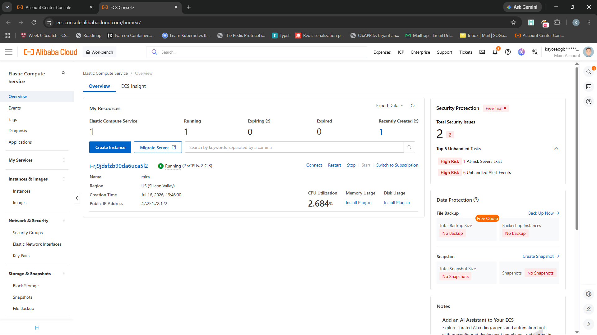

# Alibaba Cloud Deployment Proof

This document is the repository evidence that MIRA's backend runs on Alibaba
Cloud infrastructure and integrates with Alibaba Cloud's Qwen models through the
DashScope OpenAI-compatible API. Every claim below links to a file that actually
exists in this repository. The compute host — an Alibaba Cloud ECS instance —
is not encoded in the code itself; it is evidenced by the console screenshot
committed alongside this document.

## 1. Deployment overview

MIRA's backend runs on an **Alibaba Cloud Elastic Compute Service (ECS)**
instance as a set of Docker containers, orchestrated by
[`docker-compose.prod.yml`](../docker-compose.prod.yml) behind an Nginx reverse
proxy, and served on the public domain **`mira.ninja`** (see
[`nginx/default.conf`](../nginx/default.conf)).

The following MIRA components run on the host:

| Component | Container / command | Source |
| --- | --- | --- |
| FastAPI product API | `uvicorn api.main:app` on port 8000 | [`docker-compose.prod.yml`](../docker-compose.prod.yml) |
| Background memory worker | `python -m scripts.run_worker` | [`scripts/run_worker.py`](../scripts/run_worker.py) |
| Standalone MCP service | `uvicorn integrations.mcp.service:app` on port 8090 | [`integrations/mcp/service.py`](../integrations/mcp/service.py) |
| Frontend (built static site) | Nginx-served production build on port 80 | [`frontend/Dockerfile`](../frontend/Dockerfile) |
| Reverse proxy + TLS | `nginx:1.27-alpine` + `certbot` | [`nginx/default.conf`](../nginx/default.conf) |
| Log viewer | `amir20/dozzle` at `/logs` (basic-auth protected) | [`docker-compose.prod.yml`](../docker-compose.prod.yml) |

**Compute host — Alibaba Cloud ECS.** The deployment workflow
[`.github/workflows/deploy.yml`](../.github/workflows/deploy.yml) connects to the
production server over SSH using repository secrets (`DEPLOY_HOST`, `DEPLOY_USER`,
`DEPLOY_PORT`, `DEPLOY_SSH_KEY`), so the host identity is not encoded in the code
itself. The Alibaba Cloud ECS instance running these containers is evidenced by
the console screenshot below.



*Alibaba Cloud ECS console — the `mira` instance
(`i-rj9jdsfzb90da6uca5l2`, 2 vCPU / 2 GiB, US · Silicon Valley) is in the
**Running** state with public IP `47.251.72.122`. This is the infrastructure
evidence that the SSH deploy target (`DEPLOY_HOST`) is an Alibaba Cloud ECS
instance.*

## 2. Qwen Cloud integration

MIRA's confirmed, in-repository Alibaba Cloud dependency is **Qwen via
DashScope**, Alibaba Cloud's OpenAI-compatible model API. The default provider
profile targets the DashScope international endpoint.

- Provider profile (endpoint + models):
  [`core/llm/profiles.py`](../core/llm/profiles.py) — the `dashscope` profile sets
  `chat_endpoint="https://dashscope-intl.aliyuncs.com/compatible-mode/v1/chat/completions"`,
  `chat_model="qwen-plus-2025-07-28"`, and
  `embedding_endpoint="https://dashscope-intl.aliyuncs.com/compatible-mode/v1/embeddings"`
  with `embedding_model="text-embedding-v4"`.
- Client boundary (how the endpoint/model/key are resolved and called):
  [`core/llm/qwen.py`](../core/llm/qwen.py) — `DEFAULT_DASHSCOPE_ENDPOINT` points at
  the same `dashscope-intl.aliyuncs.com` host; `_load_base_url()`,
  `_load_chat_model()`, `_load_api_key()`, and `_create_openai_client()` build an
  OpenAI-compatible client against it.

The provider is selectable — `siliconflow`, `deepseek`, and `gemini` profiles
also exist — but `LLM_PROFILE=dashscope` is the default in
[`.env.example`](../.env.example), so out of the box MIRA calls Qwen on Alibaba
Cloud DashScope.

**Environment variables (names only — never commit real values):**

| Variable | Purpose |
| --- | --- |
| `LLM_PROFILE` | Selects the provider preset; `dashscope` by default. |
| `DASHSCOPE_API_KEY` | Credential for the DashScope/Qwen API. |
| `LLM_API_KEY` | Optional generic key override, checked before the profile key. |
| `LLM_MODEL`, `LLM_CHAT_ENDPOINT`, `LLM_PROVIDER` | Optional explicit overrides of the profile defaults. |
| `DASHSCOPE_CHAT_ENDPOINT` | Legacy DashScope endpoint fallback. |

Key resolution order is defined in `_load_api_key()`
([`core/llm/qwen.py`](../core/llm/qwen.py)): `LLM_API_KEY` → the active profile's
key env (`DASHSCOPE_API_KEY` for the dashscope profile) → `DASHSCOPE_API_KEY`.

## 3. Deployment architecture

The request and data flow, consistent with
[`docker-compose.prod.yml`](../docker-compose.prod.yml) and
[`nginx/default.conf`](../nginx/default.conf):

```
                         (public domain: mira.ninja, TLS via certbot/Let's Encrypt)
                                          │
                                    ┌─────▼─────┐
   Browser / MCP client ───────────▶│   Nginx   │  reverse proxy + TLS termination
                                    └─────┬─────┘
             ┌────────────────────────────┼───────────────────────────┐
             │                            │                           │
        location /              location /api/                 location /mcp,
             │                            │                    /oauth/, /auth/github/
      ┌──────▼──────┐            ┌─────────▼────────┐          ┌────────▼────────┐
      │  frontend    │           │  FastAPI  api    │          │  MCP service    │
      │ (static, :80)│           │  (uvicorn :8000) │          │ (uvicorn :8090) │
      └──────────────┘           └───┬──────────┬───┘          └────────┬────────┘
                                     │          │                       │
                            reads/writes    calls Qwen                  │
                                     │          │                       │
                       ┌─────────────▼──┐   ┌───▼──────────────────┐    │
                       │  SQLite         │   │  Qwen / DashScope    │    │
                       │  (source of     │   │  dashscope-intl.     │    │
                       │   truth)        │   │  aliyuncs.com        │    │
                       └───────┬─────────┘   └──────────────────────┘    │
                               │                                         │
                       ┌───────▼─────────┐                               │
                       │  ChromaDB        │◀──────────────────────────────┘
                       │  (vector index)  │
                       └───────▲─────────┘
                               │  polls slow-path queue, writes durable memory + vectors
                       ┌───────┴─────────┐
                       │  memory worker   │  (python -m scripts.run_worker)
                       └──────────────────┘
```

Notes grounded in the configuration:

- The `api`, `worker`, and `mcp` services share the same image and the same
  mounted data volumes (`/data/sqlite`, `/data/chroma`, `/data/model-cache`) via
  `MIRA_DB_PATH`, `CHROMA_DB_PATH`, and `LOCAL_EMBEDDING_CACHE_DIR`
  ([`docker-compose.prod.yml`](../docker-compose.prod.yml)).
- The `worker` and `frontend` services declare `depends_on: api (service_healthy)`,
  so they start only after the API health check passes.
- Nginx routes `/api/` to `api:8000`, `/mcp` to `mcp:8090`, `/oauth/` and
  `/auth/github/` to the API, `/logs/` to the Dozzle log viewer (basic-auth), and
  everything else to the frontend.
- **Process management** is Docker Compose with per-service `healthcheck` and
  `restart`-on-dependency ordering. No systemd unit files exist in the repository.

## 4. Proof files

| File | Repository path | What it proves |
| --- | --- | --- |
| Production Compose | [`docker-compose.prod.yml`](../docker-compose.prod.yml) | The full deployed service topology (api, worker, mcp, frontend, nginx, certbot, logs), volumes, and health checks. |
| Deployment workflow | [`.github/workflows/deploy.yml`](../.github/workflows/deploy.yml) | CI-triggered build of Docker images, push to DockerHub, and SSH deploy to the production host. |
| Nginx config | [`nginx/default.conf`](../nginx/default.conf) | Public domain `mira.ninja`, TLS termination, and reverse-proxy routing to each backend service. |
| Backend Dockerfile | [`Dockerfile`](../Dockerfile) | How the FastAPI/worker/MCP image is built (python:3.11-slim, uvicorn on 8000). |
| Frontend Dockerfile | [`frontend/Dockerfile`](../frontend/Dockerfile) | How the frontend production image (Nginx-served build) is built. |
| Qwen profile | [`core/llm/profiles.py`](../core/llm/profiles.py) | DashScope (Alibaba Cloud Qwen) endpoint, chat model, and embedding model. |
| Qwen client | [`core/llm/qwen.py`](../core/llm/qwen.py) | The OpenAI-compatible client that calls the DashScope endpoint and resolves the API key. |
| Env example | [`.env.example`](../.env.example) | `LLM_PROFILE=dashscope` default and the (empty) `DASHSCOPE_API_KEY` slot — variable names without secrets. |
| API health route | [`api/routes/health.py`](../api/routes/health.py) | `GET /health` liveness endpoint used by the Compose health check. |
| Worker entrypoint | [`scripts/run_worker.py`](../scripts/run_worker.py) | The background memory worker process run in production. |
| MCP service | [`integrations/mcp/service.py`](../integrations/mcp/service.py) | The standalone MCP service and its `/health` route. |
| Alibaba Cloud console screenshot | [`docs/assets/alibabaproof.png`](assets/alibabaproof.png) | The running Alibaba Cloud compute instance that hosts the backend containers. |

## 5. Deployment procedure

The deployment is automated by
[`.github/workflows/deploy.yml`](../.github/workflows/deploy.yml), which runs after
a successful `CI` workflow on `main`:

1. Build and push the API image (`Dockerfile` target `base`) to DockerHub as
   `deltronfr/mira-api:<sha>` and `:latest`.
2. Build and push the frontend image (`frontend/Dockerfile` target `production`,
   `VITE_API_URL=/api`) as `deltronfr/mira-frontend:<sha>` and `:latest`.
3. SSH into the production host and, from `~/mira`:

   ```bash
   git fetch origin main
   git checkout main
   git pull --ff-only origin main

   IMAGE_TAG=<sha> docker compose -f docker-compose.prod.yml pull
   IMAGE_TAG=<sha> docker compose -f docker-compose.prod.yml up -d --remove-orphans
   IMAGE_TAG=<sha> docker compose -f docker-compose.prod.yml up -d --no-deps --force-recreate nginx

   docker image prune -f
   ```

The equivalent manual production commands are documented in the README's
"Docker production" section:

```bash
docker compose -f docker-compose.prod.yml config --quiet
docker compose -f docker-compose.prod.yml pull
docker compose -f docker-compose.prod.yml up -d --remove-orphans
```

**Manual steps not inferable from the codebase:**

- Provisioning the Alibaba Cloud ECS instance and its SSH access.
- Populating the DevOps-managed remote `.env` file (Compose reads `.env` on the
  host; the tracked [`.env.example`](../.env.example) documents the variables).
- Issuing the Let's Encrypt certificate for `mira.ninja` via the `certbot`
  service and DNS pointing the domain at the host.
- Creating the DockerHub and deploy secrets used by the workflow.

## 6. Verification

A judge can confirm the backend is running via the health endpoint defined in
[`api/routes/health.py`](../api/routes/health.py):

```bash
curl -f https://mira.ninja/api/health
# expected: {"status":"ok","service":"mira-api"}
```

Locally or on the host, the same check runs against the API container directly
(this is the Compose health check in
[`docker-compose.prod.yml`](../docker-compose.prod.yml)):

```bash
curl -f http://localhost:8000/health
```

The MCP service exposes its own `/health` route
([`integrations/mcp/service.py`](../integrations/mcp/service.py)), proxied at
`https://mira.ninja/mcp`-adjacent well-known routes per
[`nginx/default.conf`](../nginx/default.conf).

Public backend URL: **`https://mira.ninja/api`** (health check:
`https://mira.ninja/api/health`). The ECS instance's public IP is
`47.251.72.122` (see the console screenshot in section 1); the domain
`mira.ninja` resolves to it via DNS.

## 7. Security

- All credentials and secrets are supplied through environment variables and are
  **not committed**. The repository contains only [`.env.example`](../.env.example)
  with empty value slots (e.g. `DASHSCOPE_API_KEY=`); the real `.env` and
  `.env.production` files are git-ignored.
- Deployment credentials (DockerHub token, SSH key, deploy host) are stored as
  GitHub Actions secrets and referenced by name only in
  [`.github/workflows/deploy.yml`](../.github/workflows/deploy.yml).
- This document contains no API keys, tokens, private hostnames, or other
  secrets — only environment-variable names and public endpoint hostnames.

## 8. Devpost proof note

This file is the direct **repository evidence** for the Devpost field:

> "URL to your code file showing proof of Alibaba Cloud Deployment."

It links to the concrete files that demonstrate (a) Alibaba Cloud Qwen/DashScope
integration, (b) the containerized production deployment topology, and (c) the
Alibaba Cloud console screenshot committed at
[`docs/assets/alibabaproof.png`](assets/alibabaproof.png) showing the running
compute instance.

Note: Devpost's screenshot upload field is separate from the code URL. The same
console screenshot embedded above should also be **uploaded directly to Devpost**
where its rules require an image attachment — this document satisfies the "URL to
your code file" field, while the Devpost image field is filled with the screenshot
itself.
